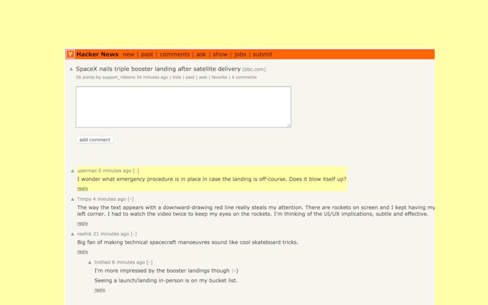
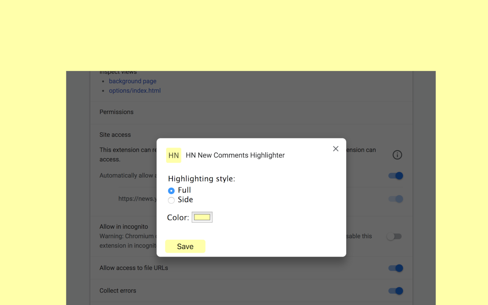

## Hacker News new comments highlighter

Chrome extension for tracking HN comments and highlighting new ones when you return.

### Installation

Install extension directly from [Chrome Web Store](https://chrome.google.com/webstore/detail/gcckmephocaopboklcpkjhlaeehmfonb?hl=en) or build from source code.

### Features
* Unread comments count in the title
* Styling and colors customisation
* Keyboard shortcuts (`j` for next, `k` for previous new comment)

[](https://www.youtube.com/watch?v=VjUY-q3uO_s "hn")






### Development
```
yarn install
```

```
yarn dev
```