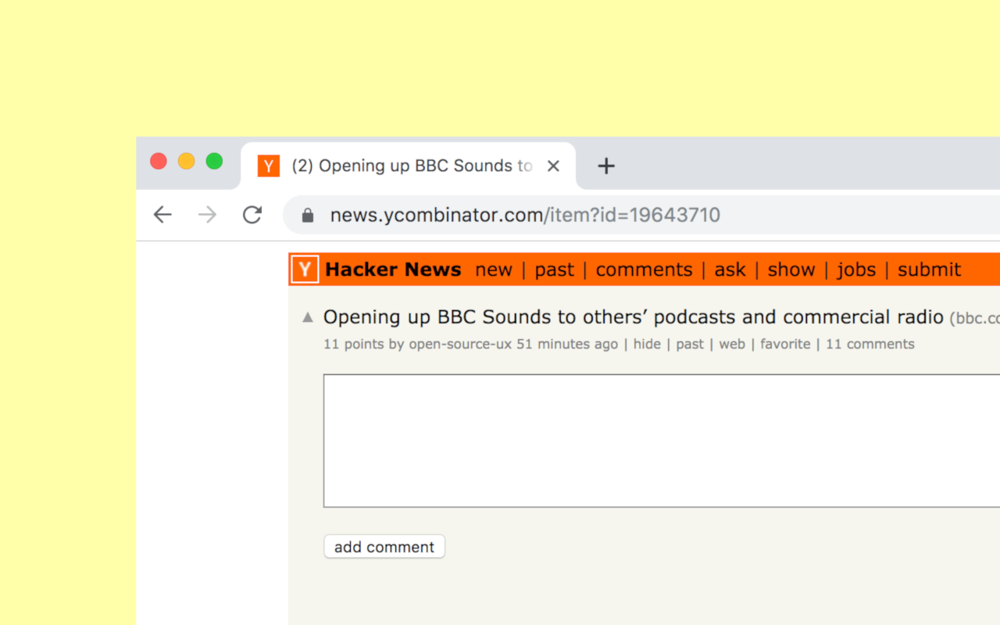

## Hacker News new comments highlighter

Chrome extension for tracking HN comments and highlighting new ones when you return.

### Features
* Unread comments count in the title
* Styling and colors customization
* Keyboard shortucts (`j` for next, `k` for previous new comment)




### Development
```
yarn install
```

```
yarn dev
```